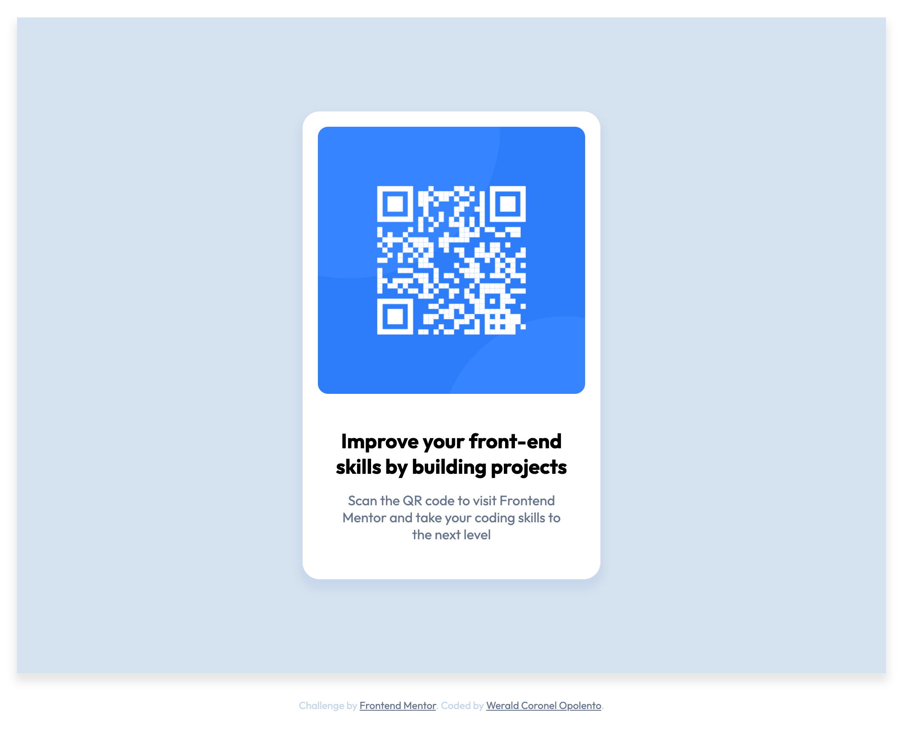

# Frontend Mentor - QR code component solution

This is a solution to the [QR code component challenge on Frontend Mentor](https://www.frontendmentor.io/challenges/qr-code-component-iux_sIO_H). Frontend Mentor challenges help you improve your coding skills by building realistic projects.

## Table of contents

- [Overview](#overview)
  - [Screenshot](#screenshot)
  - [Links](#links)
- [My process](#my-process)
  - [Built with](#built-with)
  - [What I learned](#what-i-learned)
  - [Continued development](#continued-development)
- [Author](#author)

## Overview

### Screenshot

### Links

- Github Repo Links: [Github Repositories Link](https://github.com/weraldco/frontendmentor-qr-code-component)
- Live Site URL: [QR Code Component](https://weraldco.github.io/frontendmentor-qr-code-component/)

## My process

-

### Built with

- Semantic HTML5 markup
- CSS custom properties
- Flexbox
- CSS Grid
- Mobile-first workflow

### What I learned

It's like a refresher activity for me, and I want to practice my existing skill more. Taking this challenge in Frontend Mentor let me learn new things like how to properly code in semantic way, and the var() css way.

### Continued development

I'm practicing to code in HTML in sematic way and in this Frontend Mentor Challenge I want to finish all the HTML CSS Challenge first.

## Author

- Website - [weraldco](https://wcoop.vercel.app)
- Frontend Mentor - [@weraldco](https://www.frontendmentor.io/profile/weraldco)
- Github - [@weraldco](https://github.com/weraldco)
